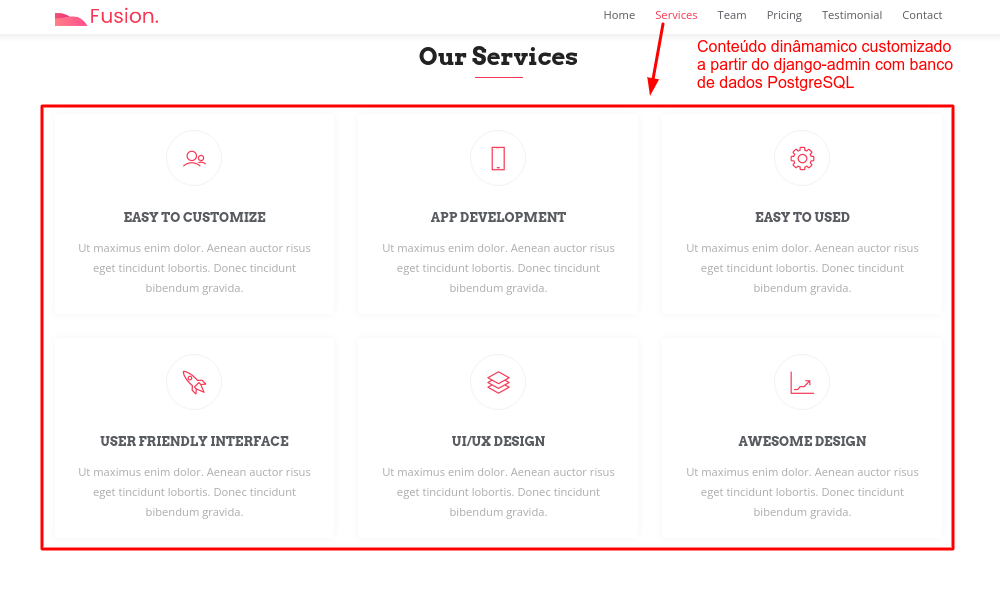
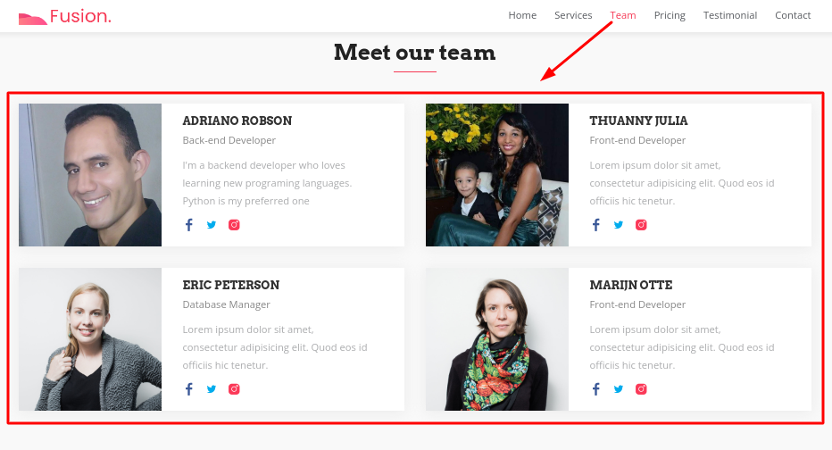

# Implementção de Back-end com Django de Template Bootstrap4

> Template implementado com back-end em Django com Banco de dados PostgreSQL que permite customização de algumas sections da página a partir do django-admin.  

<!-- Informações curtas sobre o projeto -->
O objetivo desse projeto é mostrar as vantagens em usar o django-admin para customizar um template. 

Com django-admin é possível adicinar ou remover conteúdo dinâmicamente da página web do Template
<!-- Fim informações curtas -->

<!-- Aqui colocamos um scress shot do projeto -->
 
 
<!-- Fim screen shots -->

<!-- Se você quiser passar alguma informação sobre instalação, deve seguir esse padrão -->
## Instalação
 
Execute os seguintes comandos no terminal dentro do diretório raiz do projeto

```sh
docker-compose up
```  


Criação das migratios para criação das tabelas no banco de dados

```sh
docker exec -it template-django_web_1 python manage.py migrate
```  

Criação de super usuário do django-admin

```sh
docker exec -it template-django_web_1 python manage.py createsuperuser
```  

<!-- Fim info instalação -->

<!-- Exemplo de uso -->
## Acessar a página web

Após executar os comandos acima, acesse o template pelo navegador através do endereço: http://0.0.0.0:8000/

#### Customizar conteúdos da seção service e team da página web

Acessar o endereço http://0.0.0.0:8000/admin
Preencha as tabelas Cargos, Funcionários e Serviços e atualize a página http://0.0.0.0:8000/ para ver o resultado


<!-- Fim exemplo de uso -->
 
[@AdrianoRobson](https://www.linkedin.com/in/adriano-robson/)  
 
[github](https://github.com/AdrianoRobson)

<!-- Fim informações sobre o criador -->
 